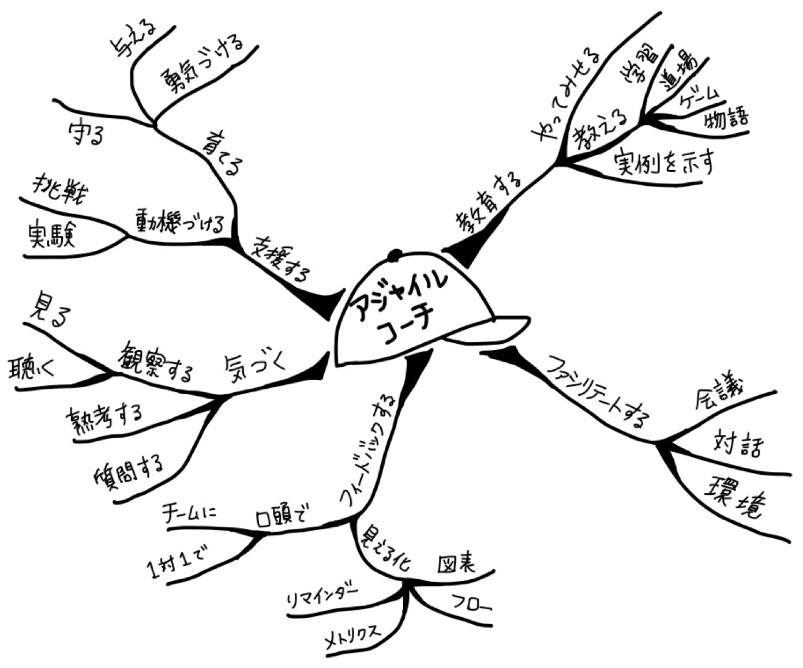

# アジャイルコーチングの肌触り

ここではアジャイルコーチングについてのノウハウをまとめます。  

アジャイルコーチのスコープは、書籍「アジャイルコーチング」の図に基づき整理していきます。

| 大項目                | 中項目            | 小項目              |
| --------------------- | ----------------- | ------------------- |
| 1. 支援する           | 1-1. 育てる       | 1-1-1. 守る         |
| -                     | -                 | 1-1-2. 与える       |
| -                     | -                 | 1-1-3. 勇気づける   |
| -                     | 1-2. 動機づける   | 1-2-1. 挑戦         |
| -                     | -                 | 1-2-2. 実験         |
| 2. 気づく             | 2-1. 観察する     | 2-1-1. 見る         |
| -                     | -                 | 2-1-2. 聴く         |
| -                     | 2-2. 熟考する     | -                   |
| -                     | 2-3. 質問する     | -                   |
| 3. フィードバックする | 3-1. 口頭で       | 3-1-1. チームに     |
| -                     | -                 | 3-1-2. 1対1で       |
| -                     | 3-2. 見える化     | 3-2-1. リマインダー |
| -                     | -                 | [3-2-2. メトリクス](3_feedback/3-2-2_metrics.md) |
| -                     | -                 | 3-2-3. フロー       |
| -                     | -                 | 3-2-4. 図表         |
| 4. ファシリテートする | [4-1. 会議](4_facilitate/4-1_meeting.md)         | -                   |
| -                     | 4-2. 対話         | -                   |
| -                     | 4-3. 環境         | -                   |
| 5. 教育する           | 5-1. やってみせる | -                   |
| -                     | 5-2. 教える       | [5-2-1. 学習](5_educate/5-2-1_learning.md)         |
| -                     | -                 | 5-2-2. 道場         |
| -                     | -                 | 5-2-3. ゲーム       |
| -                     | -                 | 5-2-4. 物語         |
| -                     | 5-3. 実例を示す   | -                   |

------

# エクストリームプログラミングの肌触り

ここではエクストリームプログラミングについてのノウハウをまとめます。  

エクストリームプログラミングのプラクティスの項目は、[Scrum Starter Guide](https://www.ryuzee.com/wp-content/site_images/7150/scrum-starter-guide.pdf)を参考にしています。

### 共同のプラクティス

- イテレーション
- 共通の用語
- オープンなワークスペース
- ふりかえり

### 開発のプラクティス

- テスト駆動開発
- ペアプログラミング
- リファクタリング
- ソースコードの共同所有
- 継続的インテグレーション
- YAGNI

### 管理者のプラクティス

- 責任の受け入れ
- 援護
- 四半期ごとの見直し
- ミラー
- 最適なペース

### 顧客のプラクティス

- ストーリー
- リリース計画
- 受け入れテスト
- 短期リリース
